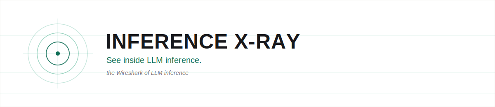
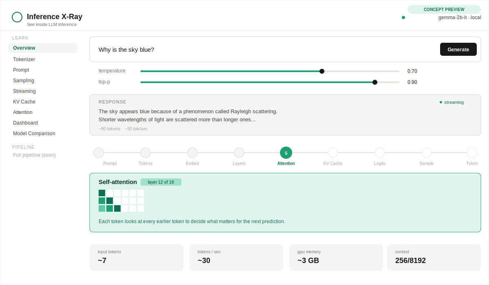
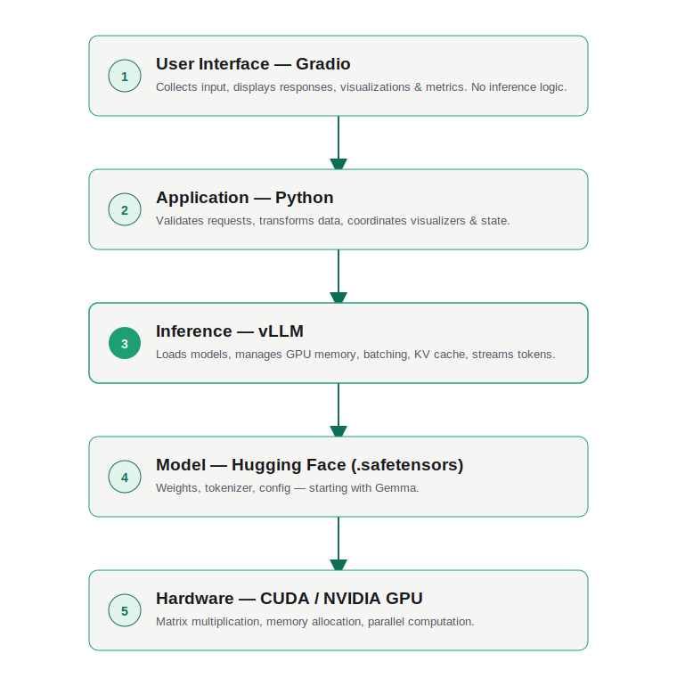
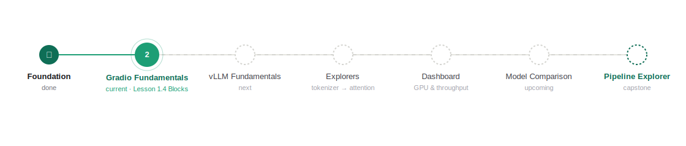

<p align="center">
  
</p>

<p align="center">
  
  
  
  
  
</p>

## What if Wireshark existed for AI?

The first time I opened Wireshark, networking stopped feeling like magic. Packets. TCP handshakes. DNS lookups. I could finally see what was happening.

Years later, while learning AI, I found myself wanting that same visibility. Every time I press Enter on an LLM prompt, I get the opposite feeling. Tokens get created, attention shifts, the KV cache grows, sampling picks a word — and none of it is visible.

**Inference X-Ray** makes that visible. One prompt, one continuous, watchable journey from keystroke to token.

<p align="center">
  
</p>

<p align="center"><sub>Concept preview — the interface above is a mockup of where this is heading, not a shipped screenshot. See <a href="#roadmap">Roadmap</a> for what's actually built today.</sub></p>

## Imagine this

You type:

> **"Why is the sky blue?"**

Instead of just getting an answer, you watch the prompt travel through the model — live:

```
Prompt → Tokenizer → Embeddings → Transformer Layers → Self-Attention
       → KV Cache → Logits → Sampling → Next Token → repeat...
```

Every stage is visible. Every decision is inspectable. Nothing is hidden behind an API call.

Click into any stage — Tokenizer, Attention, KV Cache, whatever you're curious about — and see exactly what happened there for that specific request. Useful when an output looks wrong or latency spikes and you need to find where. Just as useful when nothing's broken and you're a student trying to actually understand what a transformer does, instead of memorizing it for an exam.

## Why this exists

Most AI tools answer *"what did the model say?"* Inference X-Ray answers the harder questions:

- Why this token, and not another one?
- What is the KV cache actually doing?
- How does temperature reshape the output?
- What is vLLM optimizing under the hood?
- Why does streaming feel instant?

Not another chatbot. The tool I wish existed when I started learning inference.

## Why the name?

We already have tools that let us inspect systems we'd otherwise treat as black boxes:

- Wireshark for networks
- Process Explorer for operating systems
- Chrome DevTools for web applications
- Debuggers for code

Inference X-Ray extends that same idea to AI — inspecting the complete inference pipeline, from the first token to the last.

## Explore every stage

| Module | What it shows |
|---|---|
| Tokenizer Explorer | Vocabulary, token IDs, decoding |
| Embeddings Visualizer | The vector space a prompt lands in |
| Attention Explorer | Which tokens attend to which, and why |
| KV Cache Explorer | Memory growing in real time, and why it speeds things up |
| Sampling Playground | Temperature, top-k, top-p — watch outputs shift live |
| Streaming Explorer | Token-by-token generation, latency, throughput |
| Inference Dashboard | GPU memory, batching, PagedAttention |
| Pipeline Explorer | Every stage above, reassembled into one connected run |

All of it reads from **one shared inference run** — not separate demos duct-taped together.

<p align="center">
  
</p>

## Built with

Python 3.12 &middot; uv &middot; Gradio &middot; vLLM &middot; Hugging Face models (starting with Gemma) &middot; local GPU inference

## Who this is for

If you've ever wondered what actually happens after you hit Enter — this is for you. Built for software, infra, cloud, and DevOps engineers moving into AI, CS students, and anyone curious enough to want the real mechanism, not the analogy. No ML background required, just curiosity.

## Roadmap

<p align="center">
  
</p>

Currently on **Lesson 1.4 — Gradio Blocks**, inside Phase 1 (Gradio Fundamentals). Everything past that — vLLM integration, every explorer, the dashboard, the unified pipeline view — is upcoming, built one phase at a time and in the open.

## Philosophy

> Understanding beats memorization.

Every feature has to answer three questions: what happened, how did it happen, why did it happen. If you can walk away and explain how an LLM picks its next token, the project did its job.

## Join the journey

Early stage, built in public. Ideas, issues, and discussion are welcome. If this resonates, a star helps other engineers find it.

---

<p align="center">
  <b>Wireshark didn't make networking simple. It made it visible.</b><br/>
  <b>Inference X-Ray aims to do the same for AI.</b>
</p>
